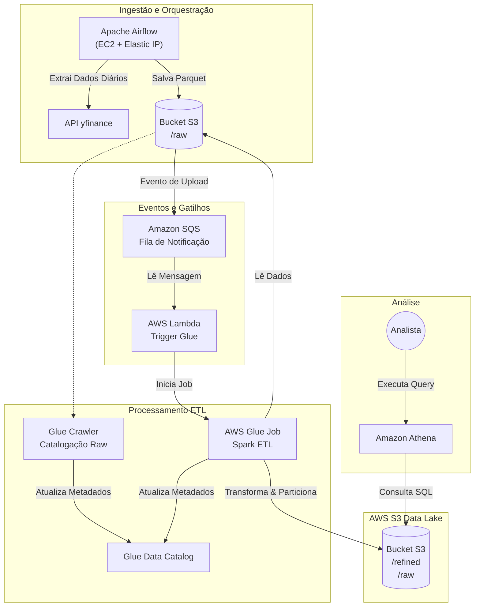

# Tech Challenge Fase 2 - Pipeline Batch Bovespa 📈

Este projeto compõe a entrega da Fase 2 da Pós Tech, focando na construção de um pipeline de Engenharia de Dados completo para ingestão, processamento e análise de dados da Bolsa de Valores (B3).

O objetivo é extrair dados de ações, armazená-los em um Data Lake na AWS, processá-los automaticamente através de uma arquitetura orientada a eventos e disponibilizá-los para consulta analítica.

## 🏛️ Arquitetura da Solução

A solução utiliza uma abordagem híbrida com orquestração via **Apache Airflow** (IaaS) e processamento **Serverless** na AWS.



## 🛠️ Tecnologias Utilizadas

* **Infraestrutura:** EC2, S3, Airflow, Glue, Athena, SQS
* **Orquestração:** Apache Airflow (Instalado direto na EC2).
* **Linguagens:** Python (Boto3, PySpark, yfinance).
* **Processamento & ETL:** AWS Glue (Spark), AWS Lambda.
* **Mensageria:** Amazon SQS.
* **Analytics:** Amazon Athena, AWS Glue Data Catalog.

## 🚀 Detalhamento da Implementação

### 1. Ingestão de Dados (Airflow na EC2)

* **Provisionamento:** Uma instância EC2 foi configurada com um IP Elástico fixo para hospedar o Apache Airflow.
* **DAG de Extração:** Foi desenvolvido um script Python (DAG) `dag_b3_stock_to_s3_raw_pipeline.py` que utiliza a biblioteca `yfinance` para buscar dados diários de ações selecionadas da B3.
* **Armazenamento Raw:** Os dados brutos são salvos diretamente no bucket S3 na pasta `raw/`, em formato Parquet.

### 2. Catalogação da Camada Raw

* Um **AWS Glue Crawler** foi configurado para varrer a pasta `raw/`. Isso permite que, mesmo antes do processamento, os dados brutos possam ser inspecionados 
via SQL no Athena para validação de integridade, sendo trigado pela `dag` `dag_b3_stock_to_s3_raw_pipeline` durante o processo de extração dos dados. 
* Dadaos catalogados em `db_b3_stocks_raw` `tb_b3_stocks`

### 3. Arquitetura Orientada a Eventos (S3 ➔ SQS ➔ Lambda)

Para garantir desacoplamento e resiliência, não acionamos o ETL diretamente.

* **S3 Event Notification:** Configurado para disparar sempre que um novo objeto é criado (`PutObject`) na pasta `raw/`.
* **Amazon SQS:** Atua como um buffer. As notificações do S3 são enviadas para uma fila SQS. Isso garante que nenhum evento seja perdido caso haja picos de ingestão.
* **AWS Lambda:** Uma função consome as mensagens da fila SQS. Foi configurada com **concorrência reservada = 1** para garantir processamento sequencial e controlado, evitando sobrecarga no Glue. A Lambda é responsável por iniciar o Job ETL.

### 4. Processamento ETL (AWS Glue)

Provisionaod job Spark no AWS Glue que realiza:

1. **Leitura:** Carrega os dados da camada `raw`.
2. **Transformações:**
   * Renomeação de colunas (tradução para PT-BR).
   * Cálculo de **Média Móvel de 3 dias** (Window Functions).
   * Cálculo de **Amplitude Diária** (Máxima - Mínima).
   * Cálculo de **Volume Médio Histórico**.

3. **Particionamento:** Os dados são enriquecidos com colunas de ano, mês e dia.
4. **Escrita (Refined):** Os dados transformados são salvos na pasta `refined/` do S3, particionados por `ano`, `mes`, `dia` e `codigo_acao`.
5. **Catalogação Automática:** O script força a atualização do Data Catalog (`enableUpdateCatalog`), garantindo que a tabela `tb_b3_stocks` no Athena esteja sempre sincronizada com os arquivos novos, no database `db_b3_stocks`

### 5. Camada de Análise (OLAP)

Os dados refinados estão disponíveis no **Amazon Athena**. Analistas podem executar consultas SQL complexas diretamente no Data Lake sem necessidade de provisionar bancos de dados tradicionais.

---

## 👣 Como Executar

1. Acesse o Airflow ([http://34.194.4.171:8080/](http://34.194.4.171:8080/)) e ative a DAG `bovespa_ingestion`.
2. Aguarde a execução da task de ingestão.
3. Verifique o Bucket S3 na pasta `raw/` para confirmar a chegada do arquivo.
4. Acompanhe no console da AWS o acionamento da Lambda e o status `Running` do Job no AWS Glue.
5. Após a conclusão, acesse o Amazon Athena e execute:
* Para visualização dados brutos:
```sql
SELECT * FROM "db_b3_stocks_raw"."tb_b3_stocks" LIMIT 10;
```
* Para visualização dados refinados:
```sql
SELECT * FROM "db_b3_stocks"."tb_b3_stocks" LIMIT 10;
```

## 📋 Requisitos Atendidos (Checklist)

| Requisito | Status | Solução Implementada |
| --- | --- | --- |
| **1. Scrap de dados B3** | ✅ | DAG no Airflow com `yfinance`. |
| **2. Ingestão no S3 (Raw/Parquet)** | ✅ | Salvo em `s3://.../raw/` via Boto3. |
| **3. Bucket acionar Lambda** | ✅ | Trigger S3 -> SQS -> Lambda. |
| **4. Lambda iniciar Glue** | ✅ | Lambda Python (Boto3) chama `start_job_run`. |
| **5. Glue Transformations (A, B, C)** | ✅ | Spark: `avg()` (A), `withColumnRenamed` (B), `Window Functions` (C). |
| **6. Salvar em Refined/Particionado** | ✅ | Partição: `ano/mes/dia/codigo_acao`. |
| **7. Catalogar no Glue Catalog** | ✅ | `enableUpdateCatalog: True` e `create_table` no script. |
| **8. Consulta via Athena** | ✅ | Tabela `db_b3_stocks.tb_b3_stocks` acessível via SQL. |

---